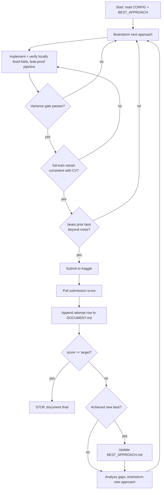

# Kaggle Playground Contest

## Overview

Run a single, repeatable optimization loop: `verify locally -> submit -> log -> compare -> decide`. All progress lives in three files so any attempt can be resumed or reverted.

Core invariants (violating any of these is violating the skill):
- **Never submit before local verification passes.**
- **Keep measurement constant** — fixed folds, fixed seed, same pipeline for CV and submit. The only variable between attempts is the approach.
- **Improvement must beat noise** (std-aware), never just be numerically higher.
- **CV is the decision; the leaderboard is a sanity check.**
- **DOCUMENT.md is append-only. BEST_APPROACH.md is overwrite-only.**

## Files

| File | Lifecycle | Purpose |
|------|-----------|---------|
| `CONFIG.md` | per competition | Parameterized target score, metric, comp id, message prefix, variance gate, stop budget |
| `DOCUMENT.md` | append-only | Changelog of every attempt: approach, CV, LB, verdict, hypothesis |
| `BEST_APPROACH.md` | overwrite-only | Checkpoint of the current best: what + code-state reference to restore it |

## The Loop



## Verification Pipeline

Run this for EVERY attempt, in order. Gates are staged cheap->expensive: kill a bad attempt at the earliest, cheapest point.

1. **Load + metric.** Parse data; configure the *exact* metric Kaggle uses (AUC includes rank/inversion; RMSE is scale-sensitive — match it precisely).
2. **Split (define once, reuse across all attempts).** No known structure -> `RepeatedStratifiedKFold` (5 folds x 3 repeats = 15 fits). Temporal/batch/group structure -> `GroupKFold` or `TimeSeriesSplit`. Fix `random_state`. Persist fold indices so every attempt reuses the identical folds.
3. **Leak-proof pipeline.** Wrap feature engineering, scaling, imputation in a `Pipeline`/`ColumnTransformer`. Everything fits on fold-train only, transforms fold-val. Reuse the same pipeline object for the full-train submission retrain.
4. **Cross-validate.** Score every fold. Report **mean +/- std**, never a bare number.
5. **Variance gate.** If `std` is too large (heuristic: `std > ~0.3 x plausible metric range`) -> verdict UNSTABLE. Stop. Do not submit. Brainstorm.
6. **Full-train retrain** (the submission artifact). Retrain best hyperparams on 100% of train. Re-score against the held-out folds as a sanity check; it should sit near the fold-average CV.
7. **Consistency check.** If full-train CV diverges widely from fold CV -> pipeline bug. Fix before proceeding.
8. **Compare vs prior best.** Only call it "better" if the means differ by more than the combined std overlap. Else treat as a tie and don't submit.
9. Submit the full-train model only after 5 + 7 + 8 all pass.

## Decision Rules

- **Is this better?** `new_mean - best_mean > some overlap of their stds`. If not past noise, it's a tie — don't burn a submission.
- **Should I stop?** Stop when the LB score meets `target` in CONFIG, OR you exhaust the stop budget without a gain. Stop on a good score: a pure hill-climber will overfit the public LB (~20% of test). Set `target` with a small buffer above the requirement.
- **Restore when stuck:** if several attempts failed to beat the best, revert to `BEST_APPROACH.md`'s code state (restore via its code-state reference) and branch from there.
- **Public LB temptation:** trust CV. Only let public-LB drive a decision when CV and LB disagree consistently and stably.
- **CV vs LB offset:** after each submit, record `CV, full-train, LB` together. Over attempts you learn that comp's offset, which sharpens future stop decisions.

## Submission

Preferred path is `scripts/submit.py` (submit -> poll score -> append DOCUMENT.md row in one command). Equivalent raw CLI:

```bash
# submit
kaggle competitions submit -c <COMP> -f <submission.csv> -m "<message>"

# poll status + score (JSON)
kaggle api competitions submissions -c <COMP>
```

Message prefix: `<comp>-attempt-<n>-<cv_mean>-<lb_prev>` (configure prefix in CONFIG.md).

## Progression Steps

1. Read `CONFIG.md` and `BEST_APPROACH.md`. If no best exists, set the baseline from the first verified full-train model.
2. Confirm you have train/test files, metric, and target. Copy templates from `templates/`.
3. Run attempt 1: baseline -> verify -> submit -> log -> set BEST if it's the first.
4. Loop until target met or budget spent.

## Revision Note

If you later rework this skill, update this section with what changed and why, and what you validated.

## Common Mistakes

| Mistake | Fix |
|---------|-----|
| New folds or seed per attempt | Reuse persisted fold indices + fixed seed; else comparisons are meaningless |
| Leakage: scaling/fitting on full data before split | Fit inside fold-train within a Pipeline |
| Submitting fold-averaged predictions | Submit full-train retrain; log its CV too |
| Trusting a 0.001 gain as "better" | Gate vs std-overlap before submitting |
| Optimizing the public LB directly | Treat LB as sanity check; decide on CV |
| Editing old DOCUMENT.md rows | Append-only; old rows are evidence |
| No code-state reference in BEST | Snapshot git commit / file hash so restore is exact |
